# 🛡️ Awesome Security Information & Event Management (SIEM)

<p align="center">
  
</p>

<p align="center">
  <a href="https://github.com/ishandutta2007/Awesome-Awesome-Awesome"></a><a href="https://discord.gg/jc4xtF58Ve"></a>
  <a href="https://github.com/ishandutta2007/Awesome-Security-Information-n-Event-Management/stargazers"></a>
  <a href="https://github.com/ishandutta2007/Awesome-Security-Information-n-Event-Management/network/members"></a>
  <a href="https://github.com/ishandutta2007/Awesome-Security-Information-n-Event-Management/issues"></a>
  <a href="https://github.com/ishandutta2007/Awesome-Security-Information-n-Event-Management/blob/main/LICENSE"></a>
  <a href="https://github.com/ishandutta2007"></a>
</p>

> 🚀 **A comprehensive, curated ecosystem of Security Information and Event Management (SIEM) platforms, centralized log management, security analytics, detection engineering (Sigma/YARA), correlation engines, threat hunting, UEBA, SOAR orchestration, and open-source SOC architectures.**

**Key Topics & SEO Keywords**: `SIEM`, `Security Information and Event Management`, `Log Management`, `Security Analytics`, `Detection Engineering`, `Threat Hunting`, `UEBA`, `User and Entity Behavior Analytics`, `SOC`, `Security Operations Center`, `Correlation Engine`, `Sigma Rules`, `YARA`, `Suricata`, `Zeek`, `Wazuh`, `OpenSearch`, `Elastic Security`, `SOAR`, `Cybersecurity`, `Cloud SIEM`, `Incident Response`.

**Last updated: September 2026**

Security Information & Event Management (**SIEM**) platforms collect, normalize, correlate, search and analyze security telemetry from across an organization's infrastructure.

A modern SIEM typically processes:

```text
Endpoints
   ↓
Servers
   ↓
Network Devices
   ↓
Cloud & Identity
   ↓
Applications & SaaS
   ↓
Security Sensors
   ↓
SIEM & Log Lake
   ↓
Detection & Correlation
   ↓
Investigation & Hunting
   ↓
Automated Response (SOAR)
```

Examples include **Splunk Enterprise Security, Microsoft Sentinel, Google Security Operations, Elastic Security, Exabeam, Sumo Logic Cloud SIEM, LogRhythm, Devo, IBM QRadar and Chronicle SIEM**.

The modern SIEM ecosystem increasingly combines:

* 📥 Centralized log management and streaming ingestion
* 🔍 Security analytics and petabyte-scale search
* 🛡️ Detection engineering (Sigma, YARA, Snort, Zeek)
* ⚡ Multi-event correlation and risk-based alerting (RBA)
* 🧠 Threat intelligence integration (STIX/TAXII, MISP, OpenCTI)
* 👤 Behavioral analytics and User/Entity Behavior Analytics (UEBA)
* 🎯 Proactive threat hunting and attack graph exploration
* 🚨 Case management, incident triage, and forensic timelines
* 🔄 SOAR integration and automated playbook execution
* 📋 Automated compliance auditing and regulatory reporting (PCI-DSS, HIPAA, SOC 2, ISO 27001, FedRAMP)
* ☁️ Cloud security telemetry (AWS CloudTrail, Azure Activity, GCP Audit)
* 💻 Host and endpoint telemetry (osquery, Sysmon, Auditd, Velociraptor)
* 🌐 Deep network telemetry and packet capture (Suricata, Zeek, Arkime)
* 🤖 AI-assisted investigation and alert summarization

This reference focuses on **open-source alternatives and composable building blocks**, including Wazuh, OpenSearch, Security Onion, Elastic Stack, OSSEC, Graylog, AlienVault OSSIM, SIEMonster, and complementary SOC tools.

---

## 📑 Table of Contents

* [🏢 SaaS & Hosted Commercial Platforms](#-saas--hosted-commercial-platforms)
* [⭐ Open-Source Leaderboard (Ranked by Stars)](#-open-source-leaderboard-ranked-by-stars)
* [🛠️ Open-Source SIEM Platforms](#️-open-source-siem-platforms)
* [📊 Open-Source Log Analytics & Security Analytics](#-open-source-log-analytics--security-analytics)
* [📦 Open-Source SOC-in-a-Box Platforms](#-open-source-soc-in-a-box-platforms)
* [💻 Open-Source Endpoint Security & HIDS](#-open-source-endpoint-security--hids)
* [🌐 Open-Source Network Security Telemetry](#-open-source-network-security-telemetry)
* [🧠 Open-Source Threat Intelligence](#-open-source-threat-intelligence)
* [🎯 Open-Source Detection Engineering](#-open-source-detection-engineering)
* [⚡ Open-Source Security Data Pipelines](#-open-source-security-data-pipelines)
* [🧩 Additional Strong Open-Source Options](#-additional-strong-open-source-options)
* [🔄 Commercial Platform → Open-Source Equivalents](#-commercial-platform--open-source-equivalents)
* [🏗️ Frameworks for Building Custom SIEM Platforms](#️-frameworks-for-building-custom-siem-platforms)
* [📐 Reference Architecture](#-reference-architecture)
* [🔄 Typical SIEM Workflow](#-typical-siem-workflow)
* [📥 Log Collection Workflow](#-log-collection-workflow)
* [🎯 Detection Engineering Workflow](#-detection-engineering-workflow)
* [🏹 Threat Hunting Workflow](#-threat-hunting-workflow)
* [🔍 Incident Investigation Workflow](#-incident-investigation-workflow)
* [☁️ Cloud SIEM Workflow](#-cloud-siem-workflow)
* [📋 Capability Matrix](#-capability-matrix)
* [💡 Recommended Open-Source Stacks](#-recommended-open-source-stacks)
* [🤔 What Is Still Difficult to Reproduce in Open Source?](#-what-is-still-difficult-to-reproduce-in-open-source)
* [✨ Why Open Source Is Interesting](#-why-open-source-is-interesting)
* [🤝 How to Contribute](#-how-to-contribute)
* [📈 Star History](#-star-history)
* [⚖️ Disclaimer](#️-disclaimer)

---

## 🏢 SaaS & Hosted Commercial Platforms

> 💡 **Market Size & Industry Dynamics**: The global Security Information and Event Management (SIEM) market is valued at **$5.8B – $7.4B**, projected to surge toward **$14.2B+ by 2032** at a robust compound annual growth rate (**CAGR**) of **~14.5%**. The sector is **moderately concentrated at the enterprise peak but highly fragmented across modern architectures**: mega-cap conglomerates (Microsoft, Google Cloud, Cisco/Splunk, IBM, CrowdStrike, Fortinet) dominate monolithic data-lake contracts and compliance consolidation, while high-velocity innovators (Elastic, Sumo Logic, Exabeam, Securonix, Devo) and open-source ecosystems (Wazuh, OpenSearch, Security Onion) drive rapid decentralization through modular, decoupled, and detection-as-code SOC deployments.

| 🏢 Platform | 📊 Company Scale (Valuation / Revenue) | 📝 Primary Model & Capabilities | 💰 Starting Pricing | 🎁 Free Tier / Trial Limits |
| :--- | :--- | :--- | :--- | :--- |
| **[Microsoft Sentinel](https://azure.microsoft.com/products/microsoft-sentinel)** | **~$3.1T+** Market Cap (Microsoft) • **~$245B+** Revenue | Cloud SIEM • Azure/Microsoft ecosystem, cloud-native analytics, automated playbooks, Defender XDR integration | **Pay-As-You-Go**: $4.30/GB ingested;<br>**Commitment Tiers**: Starts at $296.00/day ($2.96/GB) for 100 GB/day tier (~$8,880/mo; 50 GB/day preview tier at $156.00/day or $3.12/GB) | **Free Forever Plan**: Ingests Azure Activity Logs, M365 Audit Logs (SharePoint, Exchange, Teams), and Defender alerts at $0;<br>**Free Trial**: 31-day free trial with up to 10 GB/day data ingestion free on new workspaces |
| **[Google Security Operations](https://cloud.google.com/security/products/security-operations)** | **~$2.1T+** Market Cap (Alphabet / Google) • **~$330B+** Revenue | Cloud SIEM • Chronicle-scale telemetry, 12-month hot retention, unified Siemplify SOAR, Mandiant threat intelligence | Starts at **~£2,000 (~$2,550)/TB/year** (~$2.50/GB ingested; minimum annual enterprise packages start at ~$45,000/year for ~18 TB annual data allowance under Bytes of Data Ingested SKU) | **No free forever plan**;<br>**Free Trial**: 30-day enterprise Proof of Concept (POC) / interactive sandbox test-drive with access to Mandiant ThreatSpace cyber ranges |
| **[Chronicle SIEM](https://cloud.google.com/security/products/security-operations)** | **~$2.1T+** Market Cap (Alphabet / Google) • **~$330B+** Revenue | Cloud SIEM • High-scale security telemetry, petabyte-scale indexing, real-time YARA-L detection, raw event normalization (UDM) | Data-cap model starting at **~£2,000 (~$2,550)/TB/year** (~$2.50/GB ingested; entry enterprise commitments start at ~$45,000/year for ~18 TB annual ingestion capacity) | **No free forever plan**;<br>**Free Trial**: 30-day enterprise Proof of Concept (POC) / interactive evaluation environment with Mandiant threat intelligence |
| **[Splunk Enterprise Security](https://www.splunk.com/en_us/products/enterprise-security.html)** | **~$230B+** Market Cap (Cisco Systems) • **~$4.2B+** Splunk ARR | Enterprise SIEM • Broad security analytics ecosystem, correlation searches, risk-based alerting (RBA), and deep app integrations | Starts at **~$665–$1,620/GB/day/year** (~$1.82–$4.44/GB/day; entry deployments typically ~$50,000/year for 50 GB/day base ingest + ES multiplier; Splunk Cloud SVC workloads start from ~$12,000–$24,000/year) | **Free Forever Plan**: Splunk Free with 500 MB/day indexing limit (single user, standalone);<br>**Free Trial**: 14-day free trial for Splunk Cloud (up to 5 GB/day indexing) or 60-day Splunk Enterprise trial (500 MB/day) |
| **[IBM QRadar](https://www.ibm.com/products/qradar-siem)** | **~$200B+** Market Cap (IBM) • **~$62B+** Annual Revenue | Enterprise SIEM • Mature event and network flow correlation, QFlow analysis, and regulatory compliance packs | Starts at **$12,074.40/year** (~$1,006.20/month) for 500 EPS (Events Per Second) and 10,000 FPM (Flows Per Minute) base entry contract on AWS Marketplace | **Free Forever Plan**: QRadar Community Edition (CE) capped at 100 EPS and 5,000 FPM (single-node, renewable 3-month license);<br>**Free Trial**: 14-day free trial for QRadar SaaS on IBM Cloud / AWS |
| **[CrowdStrike Falcon Next-Gen SIEM](https://www.crowdstrike.com/platform/next-gen-siem/)** | **~$85B+** Market Cap • **~$3.9B+** Annual ARR | SIEM/XDR • Endpoint-centric security analytics, indexing-free LogScale architecture, and 150+ TB/day ingestion capability | **$5.95/GB** for third-party log ingestion (Pay-As-You-Go); base annual platform contracts start from ~$18,000–$25,000/year (base Falcon endpoint protection starts at $59.99/device/year) | **Perpetual Free Allowance**: Active Falcon Insight XDR subscribers receive 10 GB/day of free third-party data ingestion into Next-Gen SIEM;<br>**Free Trial**: 15-day free trial of Falcon platform for up to 100 devices/workloads |
| **[FortiSIEM](https://www.fortinet.com/products/siem/fortisiem)** | **~$60B+** Market Cap (Fortinet) • **~$5.8B+** Annual Revenue | SIEM • Fortinet ecosystem, automated CMDB discovery, network performance monitoring, and security analytics | FortiSIEM Cloud starts at **~$25,000–$28,000/year** (~$2,080–$2,330/month) for base 10 FortiSIEM Compute Unit (FCU) subscription bundle including 500 GB online storage | **No free forever plan**;<br>**Free Trial**: 30-day enterprise Proof of Concept (POC) / evaluation license arranged via Fortinet channel partners |
| **[Elastic Security](https://www.elastic.co/security)** | **~$10B+** Market Cap (Elastic N.V.) • **~$1.4B+** Annual Revenue | Search/SIEM • Elastic analytics + security detection, custom detection rules, threat hunting, and built-in endpoint security agents | **Elastic Cloud**: Hosted plans start at $95.00/month (Standard) / $109.00–$184.00/month (Platinum/Enterprise); Serverless from $0.18/GB ingested + storage;<br>**Self-Hosted**: Free Basic tier license is $0 | **Free Forever Plan**: Self-managed Elastic Security Basic tier ($0 forever, unlimited ingest on self-hosted infrastructure);<br>**Free Trial**: 14-day free trial on Elastic Cloud with full Platinum/Enterprise SIEM features |
| **[OpenText ArcSight](https://www.opentext.com/products/arcsight)** | **~$9B+** Market Cap (OpenText) • **~$5.8B+** Annual Revenue | Enterprise SIEM • Enterprise security analytics, real-time correlation (CORR-Engine), and compliance reporting | ArcSight SaaS base entry packages start at **~$24,000–$30,000/year** (~$2,000–$2,500/month for 250–500 EPS or 25–50 GB/day base ingestion bundle) | **No free forever plan**;<br>**Free Trial**: 30-day enterprise Proof of Concept (POC) / evaluation license with pre-configured connectors and compliance packs |
| **[Rapid7 InsightIDR](https://www.rapid7.com/products/insightidr/)** | **~$2.5B+** Market Cap • **~$820M+** Annual ARR | Cloud SIEM/XDR • Detection + investigation, endpoint telemetry (Insight Agent), attacker behavior analytics, deception technology | **$5.89/asset/month** ($70.40/asset/year) for Essentials tier with a 250-asset minimum commitment (~$1,472.50/month or ~$17,600/year) | **Free Trial**: 30-day full-featured free trial with unlimited log source ingestion, agent deployment, and automated threat detection (no credit card required) |
| **[Exabeam](https://www.exabeam.com/)** | **~$2.4B** Combined Valuation • **~$300M+** ARR | SIEM/UEBA • Behavioral analytics, smart timelines, automated incident investigation, and baseline risk scoring | Starts at **~$36,000/year** (~$3,000/month; ~$1.97/GB) for base 50 GB/day ingestion tier on New-Scale SIEM (Security Log Management starts at ~$31,000/year) | **No free forever plan**;<br>**Free Trial**: 30-day enterprise Proof of Concept (POC) on live customer telemetry (or guided interactive sandbox demo) |
| **[Exabeam Fusion](https://www.exabeam.com/)** | **~$2.4B** Combined Valuation • **~$300M+** ARR | SIEM/UEBA • Threat detection and investigation, bundled New-Scale SIEM + UEBA + turnkey SOAR playbooks | Starts at **~$51,000/year** (~$4,250/month; ~$2.79/GB) for 50 GB/day ingestion tier with SIEM, UEBA, and Incident Responder included | **No free forever plan**;<br>**Free Trial**: 30-day guided enterprise Proof of Concept (POC) on live customer telemetry |
| **[Trellix Helix](https://www.trellix.com/en-us/products/helix.html)** | **~$2.0B+** Valuation (Symphony Technology Group) • **~$1.8B+** Revenue | SIEM/SOC • Security operations analytics, integrated XDR connecting endpoint, network, and email telemetry | Starts at **~$28,000–$32,000/year** (~$2,330–$2,660/month; ~$3.50–$5.00/endpoint/month) for base entry subscription tier (up to 500 endpoints or 100 EPS) | **No free forever plan**;<br>**Free Trial**: 30-day enterprise Proof of Value (POV) / guided pilot on monitored endpoints and network telemetry |
| **[Sumo Logic Cloud SIEM](https://www.sumologic.com/solutions/cloud-siem)** | **~$1.7B** Acquisition Valuation (Francisco Partners) • **~$320M+** ARR | Cloud SIEM • Cloud-native security analytics, Insight generation, automated correlation, and multi-tenant SaaS | Flex credits starting at **~$2.50–$3.00/GB ingested** (~$1.50–$2.00/credit; Cloud SIEM / Enterprise Security contracts start at ~$24,000/year or ~$2,000/month) | **Free Forever Plan**: Sumo Logic Free tier includes 500 MB/day log ingestion for up to 3 users;<br>**Free Trial**: 30-day free trial with full Cloud SIEM features and up to 1 GB/day data ingestion |
| **[Devo](https://www.devo.com/)** | **~$1.5B** Valuation (Series F Unicorn) • **~$100M+** Annual ARR | Cloud SIEM • Real-time security analytics, high-speed querying, and 400 days of included hot data retention | Ingest-based daily tiers starting at **~$2.46/GB** ($90,000/year for 100 GB/day tier with 400-day hot retention included; base mid-market contracts start from ~$30,000–$45,000/year for 30–50 GB/day) | **No free forever plan**;<br>**Free Trial**: 30-day Proof of Value (POV) / trial with full search capabilities and 400-day hot retention on customer logs |
| **[LogRhythm](https://logrhythm.com/)** | **~$1.2B+** Valuation (Merged with Exabeam) • **~$150M+** Revenue | Enterprise SIEM • High-throughput security monitoring, DetectX analytics, and compliance automation | Unified License Program (ULP) starting at **~$65.00/MPS/year** (~$32,500/year or ~$2,708/month for 500 MPS base deployment; named analyst access ~$184/user/year) | **No free forever plan**;<br>**Free Trial**: 30-day guided Proof of Concept (POC) / evaluation license for up to 500 MPS |
| **[AlienVault USM Anywhere](https://cybersecurity.opentext.com/products/usm-anywhere)** | **~$1.0B+** Valuation (LevelBlue / AT&T Cybersecurity) • **~$250M+** Revenue | Cloud SIEM • Unified security monitoring, asset discovery, vulnerability assessment, and intrusion detection | **Essentials**: Starts at $1,075.00/month (~$12,900/year);<br>**Standard**: Starts at $1,695.00/month (~$20,340/year);<br>**Premium**: Starts at $2,595.00/month | **Free Trial**: 14-day free trial of USM Anywhere with full access to cloud sensors, asset discovery, vulnerability assessment, and threat alarms (no credit card required) |
| **[Securonix](https://www.securonix.com/)** | **~$1.0B+** Valuation (Vista Equity Partners) • **~$120M+** ARR | SIEM/UEBA • Behavioral analytics, Snowflake-based cloud data architecture (EON), and insider threat detection | Capacity-based pricing starting at **~$30,000–$40,000/year** (~$2,500–$3,330/month for base 30–50 GB/day daily ingestion tier; compute and storage billed separately via Snowflake) | **No free forever plan**;<br>**Free Trial**: 30-day guided Proof of Concept (POC) / evaluation sandbox; includes Free SIEM Migration Program incentives for qualifying legacy migrations |
| **[RSA NetWitness](https://www.netwitness.com/)** | **~$500M+** Valuation (Clearlake Capital / STG) • **~$120M+** Revenue | SIEM/Network Analytics • Network-centric detection, full PCAP session reconstruction, endpoint visibility, threat hunting | Base subscription tiers start at **~$25,000–$35,000/year** (~$2,080–$2,916/month for 50 GB/day or 500 EPS base throughput tier) | **No free forever plan**;<br>**Free Trial**: 30-day guided Proof of Concept (POC) / sandbox environment with network packet capture and log ingestion |
| **[Graylog Security](https://graylog.org/products/security/)** | **~$150M+** Valuation • **~$30M+** Annual ARR | SIEM • Log analytics + security detection, Sigma rule support, AI incident summaries, and lean SOC workflows | **Graylog Security**: Starts at $18,000.00/year ($1,500.00/month) for 10 GB/day daily ingestion (or 100 GCUs);<br>**Graylog Enterprise**: Starts at $15,000.00/year ($1,250.00/month) | **Free Forever Plan**: Graylog Open is 100% free forever with no daily ingest cap and no volume limit (SSPL licensed, self-hosted);<br>**Free Trial**: 14-day free trial of Graylog Security on Graylog Cloud |

---

## ⭐ Open-Source Leaderboard (Ranked by Stars)

This leaderboard curates premier open-source repositories powering modern SIEM platforms, centralized log analytics, detection engineering, threat hunting, and autonomous SOC architectures. Sorted in descending order by live GitHub star counts.

| 🏆 Project | 📦 Domain / Focus | ⭐ GitHub_Stars | 📜 License | 🔗 Stargazers Link |
| :--- | :--- | :--- | :--- | :--- |
| **[Elasticsearch](https://github.com/elastic/elasticsearch)** | Security Analytics & Data Lake Search | [](https://github.com/elastic/elasticsearch/stargazers) | Elastic License / AGPL | [Stargazers](https://github.com/elastic/elasticsearch/stargazers) |
| **[Grafana](https://github.com/grafana/grafana)** | Security Observability & SOC Dashboards | [](https://github.com/grafana/grafana/stargazers) | AGPL-3.0 | [Stargazers](https://github.com/grafana/grafana/stargazers) |
| **[Apache Superset](https://github.com/apache/superset)** | Enterprise Security BI & Telemetry Viz | [](https://github.com/apache/superset/stargazers) | Apache-2.0 | [Stargazers](https://github.com/apache/superset/stargazers) |
| **[scikit-learn](https://github.com/scikit-learn/scikit-learn)** | Machine Learning & Anomaly Modeling | [](https://github.com/scikit-learn/scikit-learn/stargazers) | BSD-3-Clause | [Stargazers](https://github.com/scikit-learn/scikit-learn/stargazers) |
| **[ClickHouse](https://github.com/ClickHouse/ClickHouse)** | Ultra-Fast Columnar Security Data Lake | [](https://github.com/ClickHouse/ClickHouse/stargazers) | Apache-2.0 | [Stargazers](https://github.com/ClickHouse/ClickHouse/stargazers) |
| **[Metabase](https://github.com/metabase/metabase)** | Log Dashboards & Security Analytics | [](https://github.com/metabase/metabase/stargazers) | AGPL-3.0 | [Stargazers](https://github.com/metabase/metabase/stargazers) |
| **[Apache Kafka](https://github.com/apache/kafka)** | High-Throughput Security Event Bus | [](https://github.com/apache/kafka/stargazers) | Apache-2.0 | [Stargazers](https://github.com/apache/kafka/stargazers) |
| **[Grafana Loki](https://github.com/grafana/loki)** | Log Aggregation & Grep-Optimized Storage | [](https://github.com/grafana/loki/stargazers) | AGPL-3.0 | [Stargazers](https://github.com/grafana/loki/stargazers) |
| **[XGBoost](https://github.com/dmlc/xgboost)** | Gradient Boosted Threat Scoring Models | [](https://github.com/dmlc/xgboost/stargazers) | Apache-2.0 | [Stargazers](https://github.com/dmlc/xgboost/stargazers) |
| **[osquery](https://github.com/osquery/osquery)** | SQL-Powered Endpoint Instrumentation | [](https://github.com/osquery/osquery/stargazers) | Apache-2.0 | [Stargazers](https://github.com/osquery/osquery/stargazers) |
| **[Vector](https://github.com/vectordotdev/vector)** | High-Performance Observability Data Pipeline | [](https://github.com/vectordotdev/vector/stargazers) | MPL-2.0 | [Stargazers](https://github.com/vectordotdev/vector/stargazers) |
| **[SpiderFoot](https://github.com/smicallef/spiderfoot)** | Automated OSINT & Attack Surface Recon | [](https://github.com/smicallef/spiderfoot/stargazers) | MIT License | [Stargazers](https://github.com/smicallef/spiderfoot/stargazers) |
| **[Kibana](https://github.com/elastic/kibana)** | Elastic Investigation & Detection UI | [](https://github.com/elastic/kibana/stargazers) | Elastic License / AGPL | [Stargazers](https://github.com/elastic/kibana/stargazers) |
| **[LightGBM](https://github.com/microsoft/LightGBM)** | Fast Tree-Based UEBA Anomaly Modeling | [](https://github.com/microsoft/LightGBM/stargazers) | MIT License | [Stargazers](https://github.com/microsoft/LightGBM/stargazers) |
| **[Wazuh](https://github.com/wazuh/wazuh)** | Unified Open-Source XDR & SIEM Platform | [](https://github.com/wazuh/wazuh/stargazers) | GPL-2.0 | [Stargazers](https://github.com/wazuh/wazuh/stargazers) |
| **[Logstash](https://github.com/elastic/logstash)** | Server-Side Data Processing & Normalization | [](https://github.com/elastic/logstash/stargazers) | Elastic License / AGPL | [Stargazers](https://github.com/elastic/logstash/stargazers) |
| **[OpenSearch](https://github.com/opensearch-project/OpenSearch)** | Distributed SIEM & Security Analytics Engine | [](https://github.com/opensearch-project/OpenSearch/stargazers) | Apache-2.0 | [Stargazers](https://github.com/opensearch-project/OpenSearch/stargazers) |
| **[Fluentd](https://github.com/fluent/fluentd)** | Unified Log Collection & Routing Layer | [](https://github.com/fluent/fluentd/stargazers) | Apache-2.0 | [Stargazers](https://github.com/fluent/fluentd/stargazers) |
| **[Atomic Red Team](https://github.com/redcanaryco/atomic-red-team)** | Automated MITRE ATT&CK Detection Validation | [](https://github.com/redcanaryco/atomic-red-team/stargazers) | MIT License | [Stargazers](https://github.com/redcanaryco/atomic-red-team/stargazers) |
| **[Sigma](https://github.com/SigmaHQ/sigma)** | Generic Detection Rule Standard for SIEMs | [](https://github.com/SigmaHQ/sigma/stargazers) | DRL-1.1 | [Stargazers](https://github.com/SigmaHQ/sigma/stargazers) |
| **[PyOD](https://github.com/yzhao062/pyod)** | Comprehensive Python Outlier Detection (UEBA) | [](https://github.com/yzhao062/pyod/stargazers) | BSD-2-Clause | [Stargazers](https://github.com/yzhao062/pyod/stargazers) |
| **[OpenCTI](https://github.com/OpenCTI-Platform/opencti)** | Enterprise Cyber Threat Intelligence Platform | [](https://github.com/OpenCTI-Platform/opencti/stargazers) | Apache-2.0 | [Stargazers](https://github.com/OpenCTI-Platform/opencti/stargazers) |
| **[YARA](https://github.com/VirusTotal/yara)** | Pattern Matching Swiss Army Knife for Malware | [](https://github.com/VirusTotal/yara/stargazers) | BSD-3-Clause | [Stargazers](https://github.com/VirusTotal/yara/stargazers) |
| **[Falco](https://github.com/falcosecurity/falco)** | Cloud-Native Runtime Threat Detection & Alerts | [](https://github.com/falcosecurity/falco/stargazers) | Apache-2.0 | [Stargazers](https://github.com/falcosecurity/falco/stargazers) |
| **[Graylog Server](https://github.com/Graylog2/graylog2-server)** | Centralized Log Management & SIEM Core | [](https://github.com/Graylog2/graylog2-server/stargazers) | SSPL | [Stargazers](https://github.com/Graylog2/graylog2-server/stargazers) |
| **[Fluent Bit](https://github.com/fluent/fluent-bit)** | Fast & Lightweight Telemetry Processor | [](https://github.com/fluent/fluent-bit/stargazers) | Apache-2.0 | [Stargazers](https://github.com/fluent/fluent-bit/stargazers) |
| **[Zeek](https://github.com/zeek/zeek)** | Network Security Monitoring & Behavioral Protocol Analysis | [](https://github.com/zeek/zeek/stargazers) | BSD-3-Clause | [Stargazers](https://github.com/zeek/zeek/stargazers) |
| **[OpenTelemetry Collector](https://github.com/open-telemetry/opentelemetry-collector)** | Vendor-Neutral Telemetry Collection Pipeline | [](https://github.com/open-telemetry/opentelemetry-collector/stargazers) | Apache-2.0 | [Stargazers](https://github.com/open-telemetry/opentelemetry-collector/stargazers) |
| **[Arkime](https://github.com/arkime/arkime)** | Large-Scale Full Network Packet Capture & Search | [](https://github.com/arkime/arkime/stargazers) | Apache-2.0 | [Stargazers](https://github.com/arkime/arkime/stargazers) |
| **[CALDERA](https://github.com/mitre/caldera)** | Automated Adversary Emulation Framework | [](https://github.com/mitre/caldera/stargazers) | Apache-2.0 | [Stargazers](https://github.com/mitre/caldera/stargazers) |
| **[Suricata](https://github.com/OISF/suricata)** | High-Performance Network IDS/IPS/NSM | [](https://github.com/OISF/suricata/stargazers) | GPL-2.0 | [Stargazers](https://github.com/OISF/suricata/stargazers) |
| **[MISP](https://github.com/MISP/MISP)** | Malware Information Sharing & Threat Intelligence | [](https://github.com/MISP/MISP/stargazers) | GPL-3.0 | [Stargazers](https://github.com/MISP/MISP/stargazers) |
| **[Apache NiFi](https://github.com/apache/nifi)** | Visual Data Flow Orchestration & Routing | [](https://github.com/apache/nifi/stargazers) | Apache-2.0 | [Stargazers](https://github.com/apache/nifi/stargazers) |
| **[River](https://github.com/online-ml/river)** | Online Machine Learning for Streaming Logs | [](https://github.com/online-ml/river/stargazers) | BSD-3-Clause | [Stargazers](https://github.com/online-ml/river/stargazers) |
| **[GRR Rapid Response](https://github.com/google/grr)** | Enterprise Remote Live Forensics & Triage | [](https://github.com/google/grr/stargazers) | Apache-2.0 | [Stargazers](https://github.com/google/grr/stargazers) |
| **[OSSEC](https://github.com/ossec/ossec-hids)** | Host-Based Intrusion Detection System (HIDS) | [](https://github.com/ossec/ossec-hids/stargazers) | GPL-2.0 | [Stargazers](https://github.com/ossec/ossec-hids/stargazers) |
| **[Tetragon](https://github.com/cilium/tetragon)** | eBPF-Based Security Observability & Runtime Enforcement | [](https://github.com/cilium/tetragon/stargazers) | Apache-2.0 | [Stargazers](https://github.com/cilium/tetragon/stargazers) |
| **[YARA Rules](https://github.com/Yara-Rules/rules)** | Curated Open-Source YARA Rule Library | [](https://github.com/Yara-Rules/rules/stargazers) | GPL-3.0 | [Stargazers](https://github.com/Yara-Rules/rules/stargazers) |
| **[Security Onion](https://github.com/Security-Onion-Solutions/securityonion)** | Integrated SOC-in-a-Box & Threat Hunting Platform | [](https://github.com/Security-Onion-Solutions/securityonion/stargazers) | GPL-2.0 | [Stargazers](https://github.com/Security-Onion-Solutions/securityonion/stargazers) |
| **[IntelOwl](https://github.com/intelowlproject/IntelOwl)** | Threat Intelligence Orchestration & Enrichment | [](https://github.com/intelowlproject/IntelOwl/stargazers) | AGPL-3.0 | [Stargazers](https://github.com/intelowlproject/IntelOwl/stargazers) |
| **[Velociraptor](https://github.com/Velocidex/velociraptor)** | Digital Forensics & Endpoint Incident Response | [](https://github.com/Velocidex/velociraptor/stargazers) | AGPL-3.0 | [Stargazers](https://github.com/Velocidex/velociraptor/stargazers) |
| **[TheHive](https://github.com/TheHive-Project/TheHive)** | Security Incident Response & Case Management | [](https://github.com/TheHive-Project/TheHive/stargazers) | AGPL-3.0 | [Stargazers](https://github.com/TheHive-Project/TheHive/stargazers) |
| **[HELK](https://github.com/Cyb3rWard0g/HELK)** | Hunting ELK Stack with Advanced Analytics | [](https://github.com/Cyb3rWard0g/HELK/stargazers) | GPL-3.0 | [Stargazers](https://github.com/Cyb3rWard0g/HELK/stargazers) |
| **[Snort 3](https://github.com/snort3/snort3)** | Next-Gen Network Intrusion Detection System | [](https://github.com/snort3/snort3/stargazers) | GPL-2.0 | [Stargazers](https://github.com/snort3/snort3/stargazers) |
| **[Shuffle](https://github.com/Shuffle/Shuffle)** | Open-Source SOAR & Security Workflow Automation | [](https://github.com/Shuffle/Shuffle/stargazers) | AGPL-3.0 | [Stargazers](https://github.com/Shuffle/Shuffle/stargazers) |
| **[MozDef](https://github.com/mozilla/MozDef)** | Mozilla Defense Automation & SIEM Framework | [](https://github.com/mozilla/MozDef/stargazers) | MPL-2.0 | [Stargazers](https://github.com/mozilla/MozDef/stargazers) |
| **[OpenSearch Dashboards](https://github.com/opensearch-project/OpenSearch-Dashboards)** | Visualization & Threat Hunting Interface | [](https://github.com/opensearch-project/OpenSearch-Dashboards/stargazers) | Apache-2.0 | [Stargazers](https://github.com/opensearch-project/OpenSearch-Dashboards/stargazers) |
| **[Yeti](https://github.com/yeti-platform/yeti)** | Threat Intelligence & Observable Repository | [](https://github.com/yeti-platform/yeti/stargazers) | Apache-2.0 | [Stargazers](https://github.com/yeti-platform/yeti/stargazers) |
| **[Security Datasets](https://github.com/OTRF/Security-Datasets)** | Adversary Simulation Log Telemetry for Testing | [](https://github.com/OTRF/Security-Datasets/stargazers) | GPL-3.0 | [Stargazers](https://github.com/OTRF/Security-Datasets/stargazers) |
| **[Matano](https://github.com/matanolabs/matano)** | Serverless Security Data Lake & Python Detections | [](https://github.com/matanolabs/matano/stargazers) | Apache-2.0 | [Stargazers](https://github.com/matanolabs/matano/stargazers) |
| **[Cortex](https://github.com/TheHive-Project/Cortex)** | Observable Analysis & Active Response Engine | [](https://github.com/TheHive-Project/Cortex/stargazers) | AGPL-3.0 | [Stargazers](https://github.com/TheHive-Project/Cortex/stargazers) |
| **[DFIR-IRIS](https://github.com/dfir-iris/iris-web)** | Collaborative Digital Forensics Case Management | [](https://github.com/dfir-iris/iris-web/stargazers) | LGPL-3.0 | [Stargazers](https://github.com/dfir-iris/iris-web/stargazers) |
| **[ElastAlert 2](https://github.com/jertel/elastalert2)** | Real-Time Alerting Engine for Elasticsearch | [](https://github.com/jertel/elastalert2/stargazers) | Apache-2.0 | [Stargazers](https://github.com/jertel/elastalert2/stargazers) |
| **[Panther Analysis](https://github.com/panther-labs/panther-analysis)** | Detection-as-Code Rules for Cloud SIEM | [](https://github.com/panther-labs/panther-analysis/stargazers) | Apache-2.0 | [Stargazers](https://github.com/panther-labs/panther-analysis/stargazers) |
| **[Data Prepper](https://github.com/opensearch-project/data-prepper)** | OpenSearch Ingestion & Normalization Pipeline | [](https://github.com/opensearch-project/data-prepper/stargazers) | Apache-2.0 | [Stargazers](https://github.com/opensearch-project/data-prepper/stargazers) |

---

## 🛠️ Open-Source SIEM Platforms


These are the most important projects to investigate when building a SIEM without depending entirely on proprietary software.


---


### 1. [Wazuh](https://github.com/wazuh/wazuh) [](https://github.com/wazuh/wazuh/stargazers)


[GitHub](https://github.com/wazuh/wazuh)


Wazuh is one of the strongest open-source SIEM/XDR platforms.


Its architecture consists of:


```text

Wazuh Agent

     ↓

Wazuh Server

     ↓

Wazuh Indexer

     ↓

Wazuh Dashboard

```


Wazuh describes the platform as free and open source, with components covering endpoint and cloud security, SIEM/XDR, file-integrity monitoring, vulnerability detection and compliance.


Capabilities include:


* log analysis

* endpoint monitoring

* file-integrity monitoring

* vulnerability detection

* security configuration assessment

* malware detection

* compliance monitoring

* cloud security

* container security

* threat detection

* incident response

* security dashboards


It is one of the closest open-source alternatives to a traditional integrated SIEM/XDR platform.


---


### 2. [OpenSearch](https://github.com/opensearch-project/OpenSearch) [](https://github.com/opensearch-project/OpenSearch/stargazers)


[GitHub](https://github.com/opensearch-project/OpenSearch)


OpenSearch provides a powerful open-source search and analytics foundation.


Its security ecosystem can provide:


* log analytics

* security analytics

* alerting

* detection rules

* dashboards

* anomaly detection

* audit logging

* access control


OpenSearch is Apache 2.0 licensed and is a community-driven fork of Elasticsearch.


OpenSearch Security also provides encryption, authentication, access control and audit logging.


A possible SIEM stack:


```text

Fluent Bit

    ↓

OpenSearch

    ↓

Security Analytics

    ↓

Detection

    ↓

Alerting

    ↓

OpenSearch Dashboards

```


---


### 3. [Security Onion](https://github.com/Security-Onion-Solutions/securityonion) [](https://github.com/Security-Onion-Solutions/securityonion/stargazers)


[Website](https://securityonionsolutions.com/)


[GitHub](https://github.com/Security-Onion-Solutions/securityonion)


Security Onion is an integrated open security platform designed for defenders.


It combines:


* network visibility

* host visibility

* intrusion detection

* packet capture

* log management

* threat hunting

* alert management

* case management


Its current documentation describes a platform incorporating Suricata, Zeek/Suricata metadata, packet capture, Elastic Agent, osquery and Elasticsearch-based security interfaces.


Typical architecture:


```text

Network Traffic

      ↓

Suricata / Zeek

      ↓

Security Onion

      ↓

Elasticsearch

      ↓

Detection

      ↓

Hunt / Alert / Case

```


Security Onion is particularly strong for network-centric SOC operations.


---


### 4. [Elasticsearch](https://github.com/elastic/elasticsearch) [](https://github.com/elastic/elasticsearch/stargazers)


[GitHub](https://github.com/elastic/elastic-stack)


[Elastic Security](https://www.elastic.co/security)


Elastic provides:


```text

Elasticsearch

+

Kibana

+

Elastic Agent

+

Security

```


It is one of the most powerful open/self-managed foundations for security analytics.


Capabilities include:


* log ingestion

* search

* detection rules

* threat hunting

* endpoint telemetry

* network telemetry

* SIEM dashboards

* security analytics

* machine learning

* observability


> **Licensing note:** Elastic's licensing is more nuanced than the simple phrase "open source." Elasticsearch/Kibana have multiple licensing options, including AGPLv3 for portions/editions, while some capabilities remain under Elastic's commercial licensing. Verify the specific version and component before redistribution.


---


### 5. [OSSEC](https://github.com/ossec/ossec-hids) [](https://github.com/ossec/ossec-hids/stargazers)


[GitHub](https://github.com/ossec/ossec-hids)


OSSEC is one of the foundational open-source host-based intrusion detection systems.


Capabilities include:


* log analysis

* file-integrity monitoring

* rootkit detection

* compliance monitoring

* active response

* host intrusion detection


OSSEC is especially useful as a lightweight HIDS layer.


```text

Endpoint

   ↓

OSSEC Agent

   ↓

OSSEC Manager

   ↓

Alerts

```


Wazuh originated from the OSSEC ecosystem and expanded it significantly.


---


### 6. AlienVault OSSIM


[GitHub](https://github.com/AlienVault-ossim/ossim)


OSSIM is one of the best-known historical open-source SIEM platforms.


It combines security technologies such as:


* event collection

* correlation

* vulnerability assessment

* IDS

* asset discovery

* risk assessment


It remains historically important to the open-source SIEM ecosystem.


---


## 📊 Open-Source Log Analytics & Security Analytics


Not every project in this section is a complete SIEM.


However, these platforms can provide the **data, search and analytics layer** needed to construct one.


---


### [[OpenSearch](https://github.com/opensearch-project/OpenSearch)] [](https://github.com/opensearch-project/OpenSearch/stargazers) (https://github.com/opensearch-project/OpenSearch) [](https://github.com/opensearch-project/OpenSearch/stargazers)


[GitHub](https://github.com/opensearch-project/OpenSearch)


Strong for:


* log storage

* full-text search

* analytics

* alerting

* dashboards

* security analytics

* distributed data


---


### [[OpenSearch](https://github.com/opensearch-project/OpenSearch)] [](https://github.com/opensearch-project/OpenSearch/stargazers) (https://github.com/opensearch-project/OpenSearch) [](https://github.com/opensearch-project/OpenSearch/stargazers) Dashboards


[GitHub](https://github.com/opensearch-project/OpenSearch-Dashboards)


Provides visualization and operational interfaces for OpenSearch.


---


### [[Elasticsearch](https://github.com/elastic/elasticsearch)] [](https://github.com/elastic/elasticsearch/stargazers) (https://github.com/elastic/elasticsearch) [](https://github.com/elastic/elasticsearch/stargazers)


[GitHub](https://github.com/elastic/elasticsearch)


A major search and analytics engine widely used in SIEM architectures.


---


### [[Kibana](https://github.com/elastic/kibana)] [](https://github.com/elastic/kibana/stargazers) (https://github.com/elastic/kibana) [](https://github.com/elastic/kibana/stargazers)


[GitHub](https://github.com/elastic/kibana)


Provides visualization, dashboards, investigation interfaces and security analytics interfaces for Elastic environments.


---


## Graylog


[GitHub](https://github.com/Graylog2/graylog2-server)


Graylog is a powerful centralized log-management platform.


It provides:


* ingestion

* parsing

* pipelines

* search

* dashboards

* streams

* alerting in applicable editions

* security analytics in commercial offerings


> **Important:** Graylog's licensing and feature split have changed over time. Verify the current edition and license before treating Graylog Open as a complete open-source SIEM.


---


### [[Grafana](https://github.com/grafana/grafana) [](https://github.com/grafana/grafana/stargazers) Loki](https://github.com/grafana/loki) [](https://github.com/grafana/loki/stargazers)


[GitHub](https://github.com/grafana/loki)


Loki is a log aggregation system optimized for efficient storage and querying.


It can serve as a logging layer but requires additional detection/security components to become a full SIEM.


---


## [Grafana](https://github.com/grafana/grafana) [](https://github.com/grafana/grafana/stargazers)


[GitHub](https://github.com/grafana/grafana)


Useful for:


* security dashboards

* alert visualization

* operational dashboards

* threat-hunting views


---


## 📦 Open-Source SOC-in-a-Box Platforms


## [Security Onion](https://github.com/Security-Onion-Solutions/securityonion) [](https://github.com/Security-Onion-Solutions/securityonion/stargazers)


Security Onion is arguably the strongest open-source choice when the objective is:


> **"Deploy a complete defensive monitoring environment rather than assemble every component manually."**


It integrates network and host visibility, intrusion detection, packet capture, log management and case-management functionality.


---


## [Wazuh](https://github.com/wazuh/wazuh) [](https://github.com/wazuh/wazuh/stargazers)


Wazuh similarly provides an integrated architecture with:


```text

Agent

+

Server

+

Indexer

+

Dashboard

```


and is explicitly positioned as an open-source unified XDR/SIEM platform.


---


## OSSIEM


[GitHub](https://github.com/dLoProdz/OSSIEM)


OSSIEM is an example of a community-built integrated stack combining components such as:


```text

Wazuh

+

Graylog

+

Grafana

+

OpenSearch

```


It is useful as a laboratory/reference deployment rather than as a drop-in production SIEM.


---


## 💻 Open-Source Endpoint Security & HIDS


Endpoint telemetry is essential to a modern SIEM.


## [Wazuh](https://github.com/wazuh/wazuh) [](https://github.com/wazuh/wazuh/stargazers)


```text

Endpoint

 ↓

Agent

 ↓

Manager

 ↓

Indexer

 ↓

SIEM

```


---


## [OSSEC](https://github.com/ossec/ossec-hids) [](https://github.com/ossec/ossec-hids/stargazers)


[GitHub](https://github.com/ossec/ossec-hids)


Lightweight HIDS with:


* log analysis

* FIM

* rootkit detection

* active response


---


## [Velociraptor](https://github.com/Velocidex/velociraptor) [](https://github.com/Velocidex/velociraptor/stargazers)


[GitHub](https://github.com/Velocidex/velociraptor)


Excellent for:


* endpoint visibility

* digital forensics

* live response

* artifact collection

* hunting


---


## [osquery](https://github.com/osquery/osquery) [](https://github.com/osquery/osquery/stargazers)


[GitHub](https://github.com/osquery/osquery)


Turns endpoint state into SQL-queryable data.


Example:


```sql

SELECT name, path, pid

FROM processes

WHERE name = 'powershell.exe';

```


A SIEM can use osquery results as high-value endpoint telemetry.


---


## [GRR](https://github.com/google/grr) [](https://github.com/google/grr/stargazers) Rapid Response


[GitHub](https://github.com/google/grr)


Useful for:


* remote forensic collection

* endpoint investigation

* incident response


---


## 🌐 Open-Source Network Security Telemetry


## [Suricata](https://github.com/OISF/suricata) [](https://github.com/OISF/suricata/stargazers)


[GitHub](https://github.com/OISF/suricata)


Provides:


* IDS

* IPS

* network security monitoring

* EVE JSON

* protocol analysis


---


## [Zeek](https://github.com/zeek/zeek) [](https://github.com/zeek/zeek/stargazers)


[GitHub](https://github.com/zeek/zeek)


Provides rich network metadata.


Example:


```text

Connection

DNS

HTTP

TLS

SSH

Files

Certificates

```


Zeek is especially valuable for threat hunting.


---


## [Arkime](https://github.com/arkime/arkime) [](https://github.com/arkime/arkime/stargazers)


[GitHub](https://github.com/arkime/arkime)


Arkime provides large-scale packet capture indexing and network-session analysis.


---


## [Suricata](https://github.com/OISF/suricata) [](https://github.com/OISF/suricata/stargazers) + Zeek + SIEM


A powerful open architecture is:


```text

Network

   ↓

Suricata

   +

Zeek

   ↓

Kafka / Fluent Bit

   ↓

OpenSearch

   ↓

SIEM

```


---


## 🧠 Open-Source Threat Intelligence


## [MISP](https://github.com/MISP/MISP) [](https://github.com/MISP/MISP/stargazers)


[GitHub](https://github.com/MISP/MISP)


MISP is a major open-source threat-intelligence platform.


It provides:


* indicators

* threat feeds

* events

* sharing

* enrichment

* correlation


---


## [OpenCTI](https://github.com/OpenCTI-Platform/opencti) [](https://github.com/OpenCTI-Platform/opencti/stargazers)


[GitHub](https://github.com/OpenCTI-Platform/opencti)


OpenCTI provides graph-oriented threat intelligence.


Useful entities include:


```text

Threat Actor

Campaign

Malware

Infrastructure

Indicator

Vulnerability

Attack Pattern

Victim

```


---


## [Yeti](https://github.com/yeti-platform/yeti) [](https://github.com/yeti-platform/yeti/stargazers)


[GitHub](https://github.com/yeti-platform/yeti)


Open-source platform for organizing and enriching threat intelligence.


---


## [IntelOwl](https://github.com/intelowlproject/IntelOwl) [](https://github.com/intelowlproject/IntelOwl/stargazers)


[GitHub](https://github.com/intelowlproject/IntelOwl)


Provides automated intelligence analysis through multiple analyzers.


---


## 🎯 Open-Source Detection Engineering


Detection engineering is one of the most important parts of a SIEM.


## [Sigma](https://github.com/SigmaHQ/sigma) [](https://github.com/SigmaHQ/sigma/stargazers)


[GitHub](https://github.com/SigmaHQ/sigma)


Sigma provides a generic, shareable format for detection rules.


Example:


```yaml

title: Suspicious PowerShell

logsource:

  product: windows

  category: process_creation


detection:

  selection:

    Image|endswith: '\powershell.exe'

    CommandLine|contains:

      - '-enc'

      - 'EncodedCommand'


  condition: selection

```


Sigma allows detection logic to be translated into platform-specific queries.


---


## [YARA](https://github.com/VirusTotal/yara) [](https://github.com/VirusTotal/yara/stargazers)


[GitHub](https://github.com/VirusTotal/yara)


YARA is primarily a malware and pattern-matching framework but can provide high-value detection signals to a SIEM.


---


## [Suricata](https://github.com/OISF/suricata) [](https://github.com/OISF/suricata/stargazers) Rules


Suricata signatures can provide network detection.


---


## [Zeek](https://github.com/zeek/zeek) [](https://github.com/zeek/zeek/stargazers) Scripts


Zeek's scripting language can create custom network detections.


---


## [Falco](https://github.com/falcosecurity/falco) [](https://github.com/falcosecurity/falco/stargazers)


[GitHub](https://github.com/falcosecurity/falco)


Falco provides runtime security detection for:


* Linux

* containers

* Kubernetes

* cloud-native workloads


---


## [Tetragon](https://github.com/cilium/tetragon) [](https://github.com/cilium/tetragon/stargazers)


[GitHub](https://github.com/cilium/tetragon)


Provides eBPF-based security observability and runtime enforcement.


---


## ⚡ Open-Source Security Data Pipelines


Large SIEM deployments require reliable data transport.


## [Fluent Bit](https://github.com/fluent/fluent-bit) [](https://github.com/fluent/fluent-bit/stargazers)


[GitHub](https://github.com/fluent/fluent-bit)


Lightweight log collector.


---


## [Fluentd](https://github.com/fluent/fluentd) [](https://github.com/fluent/fluentd/stargazers)


[GitHub](https://github.com/fluent/fluentd)


Flexible log collection and routing.


---


## [Vector](https://github.com/vectordotdev/vector) [](https://github.com/vectordotdev/vector/stargazers)


[GitHub](https://github.com/vectordotdev/vector)


High-performance observability data pipeline.


---


## [OpenTelemetry Collector](https://github.com/open-telemetry/opentelemetry-collector) [](https://github.com/open-telemetry/opentelemetry-collector/stargazers)


[GitHub](https://github.com/open-telemetry/opentelemetry-collector)


Provides vendor-neutral telemetry collection and routing.


---


## [Apache Kafka](https://github.com/apache/kafka) [](https://github.com/apache/kafka/stargazers)


[GitHub](https://github.com/apache/kafka)


Useful for:


* event buffering

* streaming

* decoupling collectors

* large-scale ingestion


---


## [Apache NiFi](https://github.com/apache/nifi) [](https://github.com/apache/nifi/stargazers)


[GitHub](https://github.com/apache/nifi)


Visual dataflow platform suitable for security telemetry ingestion and transformation.


---


### [[Logstash](https://github.com/elastic/logstash)] [](https://github.com/elastic/logstash/stargazers) (https://github.com/elastic/logstash) [](https://github.com/elastic/logstash/stargazers)


[GitHub](https://github.com/elastic/logstash)


A mature log-processing pipeline.


---


## 🧩 Additional Strong Open-Source Options


## SIEM / Security Analytics


* [Wazuh](https://github.com/wazuh/wazuh)

* [Security Onion](https://github.com/Security-Onion-Solutions/securityonion)

* [OpenSearch](https://github.com/opensearch-project/OpenSearch)

* [Elastic Stack](https://github.com/elastic/elastic-stack)

* [OSSEC](https://github.com/ossec/ossec-hids)

* [AlienVault OSSIM](https://github.com/AlienVault-ossim/ossim)

* [Graylog](https://github.com/Graylog2/graylog2-server)

* [SIEMonster](https://github.com/SIEMonster)

* [MozDef](https://github.com/mozilla/MozDef)


## Network Detection


* [Suricata](https://github.com/OISF/suricata)

* [Zeek](https://github.com/zeek/zeek)

* [Arkime](https://github.com/arkime/arkime)

* [Snort](https://github.com/snort3/snort3)

* [Corelight Community Zeek](https://github.com/zeek)


## Endpoint


* [Wazuh](https://github.com/wazuh/wazuh)

* [OSSEC](https://github.com/ossec/ossec-hids)

* [Velociraptor](https://github.com/Velocidex/velociraptor)

* [osquery](https://github.com/osquery/osquery)

* [GRR](https://github.com/google/grr)


## Threat Intelligence


* [MISP](https://github.com/MISP/MISP)

* [OpenCTI](https://github.com/OpenCTI-Platform/opencti)

* [Yeti](https://github.com/yeti-platform/yeti)

* [IntelOwl](https://github.com/intelowlproject/IntelOwl)

* [SpiderFoot](https://github.com/smicallef/spiderfoot)


## Detection


* [Sigma](https://github.com/SigmaHQ/sigma)

* [YARA](https://github.com/VirusTotal/yara)

* [Falco](https://github.com/falcosecurity/falco)

* [Tetragon](https://github.com/cilium/tetragon)

* [Suricata](https://github.com/OISF/suricata)
* [KeyDrift](https://keydrift.dev) - Scans deployed HTML and JavaScript for exposed secrets while recognizing public browser credentials that should not be treated as leaks.


## Visualization


* [Grafana](https://github.com/grafana/grafana)

* [OpenSearch Dashboards](https://github.com/opensearch-project/OpenSearch-Dashboards)

* [Kibana](https://github.com/elastic/kibana)

* [Metabase](https://github.com/metabase/metabase)

* [Apache Superset](https://github.com/apache/superset)


---


## 🔄 Commercial Platform → Open-Source Equivalents


| Commercial / Hosted Platform               | Closest Open-Source Options          | Notes                                                |

| ------------------------------------------ | ------------------------------------ | ---------------------------------------------------- |

| **Splunk Enterprise Security**             | OpenSearch + Wazuh + Sigma + Kafka   | Strong general-purpose DIY SIEM                      |

| **Microsoft Sentinel**                     | Wazuh + OpenSearch + Kafka + MISP    | Cloud integrations require additional work           |

| **Google Security Operations / Chronicle** | OpenSearch + Wazuh + Kafka + OpenCTI | Large-scale architecture required                    |

| **Elastic Security**                       | Elastic Stack + Sigma                | Closest technology-family alternative                |

| **Exabeam**                                | Wazuh + OpenSearch + custom UEBA     | Behavioral analytics requires additional engineering |

| **Sumo Logic Cloud SIEM**                  | OpenSearch + Wazuh + Fluent Bit      | Cloud-native architecture can be assembled           |

| **LogRhythm**                              | Wazuh + OpenSearch + Security Onion  | Strong open-source combination                       |

| **Devo**                                   | OpenSearch + Kafka + Vector          | High-scale analytics architecture                    |

| **IBM QRadar**                             | Wazuh + OpenSearch + Sigma + TheHive | SIEM + case management                               |

| **Chronicle SIEM**                         | OpenSearch + Kafka + OpenCTI         | Requires distributed architecture                    |

| **FortiSIEM**                              | Wazuh + OpenSearch + Suricata + Zeek | Broad security telemetry                             |

| **Rapid7 InsightIDR**                      | Wazuh + Velociraptor + OpenSearch    | Endpoint + SIEM combination                          |

| **Securonix**                              | OpenSearch + Wazuh + custom UEBA     | UEBA is the major gap                                |

| **Trellix Helix**                          | Wazuh + OpenSearch + MISP            | Integrated detection/response alternative            |

| **AlienVault USM**                         | OSSIM + Wazuh + Security Onion       | Strong OSS lineage                                   |

| **ArcSight**                               | OpenSearch + Kafka + Sigma + Wazuh   | Event correlation stack                              |

| **RSA NetWitness**                         | Security Onion + Arkime + OpenSearch | Network-centric alternative                          |

| **Graylog Security**                       | Graylog + Wazuh / OpenSearch         | Verify current licensing/features                    |

| **Generic SIEM**                           | Wazuh + OpenSearch + Sigma           | Strong starting point                                |


---


## 🏗️ Frameworks for Building Custom SIEM Platforms


A complete open-source SIEM can be assembled from multiple layers.


## 1. Data Collection


```text

Endpoint

Server

Firewall

Router

Switch

Application

Cloud

Identity

Database

Container

Kubernetes

```


Collectors:


```text

Wazuh Agent

Fluent Bit

Fluentd

Vector

OpenTelemetry

Filebeat

Syslog

Kafka

```


---


# 2. Event Transport


Use:


* Apache Kafka

* Redpanda

* NATS

* RabbitMQ

* Apache Pulsar


For large-scale SIEM:


```text

Collectors

    ↓

Kafka

    ↓

Consumers

```


This decouples ingestion from indexing and detection.


---


# 3. Normalization


A SIEM needs a common schema.


Useful standards/frameworks include:


```text

ECS

OCSF

CEF

LEEF

Syslog

OpenTelemetry

```


A normalized event might look like:


```json

{

  "timestamp": "2026-09-09T12:00:00Z",

  "source": "endpoint",

  "event_type": "process_creation",

  "user": "alice",

  "host": "WORKSTATION-01",

  "process": "powershell.exe",

  "command_line": "powershell -enc ...",

  "severity": "high"

}

```


---


# 4. Storage


Potential open-source choices:


```text

OpenSearch

Elasticsearch

ClickHouse

PostgreSQL

VictoriaMetrics

Loki

```


For high-volume security analytics, ClickHouse is particularly interesting.


[GitHub](https://github.com/ClickHouse/ClickHouse)


---


# 5. Detection Engine


Possible detection engines:


```text

Sigma

Wazuh Rules

OpenSearch Security Analytics

Elastic Detection Rules

Suricata

Zeek

Falco

YARA

Custom SQL

Custom DSL

```


---


# 6. Correlation Engine


Example:


```text

Event 1:

Multiple failed logins


+


Event 2:

Successful login


+


Event 3:

New privileged session


+


Event 4:

Large data transfer


=


Potential Account Compromise

```


A custom correlation engine can use:


```text

Temporal windows

Sequence matching

Entity correlation

Risk scoring

Graph relationships

```


---


# 7. Threat Intelligence


```text

MISP

OpenCTI

Yeti

IntelOwl

Commercial APIs

```


---


# 8. UEBA


User and Entity Behavior Analytics can model:


```text

Normal login location

Normal login time

Normal device

Normal command usage

Normal data volume

Normal resource access

```


Possible open-source components:


* Python

* scikit-learn

* PyOD

* River

* XGBoost

* LightGBM

* ClickHouse

* OpenSearch


---


# 9. Case Management


Use:


* TheHive

* DFIR-IRIS

* OpenSearch dashboards

* custom applications


---


# 10. SOAR Integration


Connect the SIEM to:


* Shuffle

* StackStorm

* n8n

* Temporal

* Ansible


Architecture:


```text

SIEM

 ↓

Alert

 ↓

SOAR

 ↓

Response

```


---


## 📐 Reference Architecture


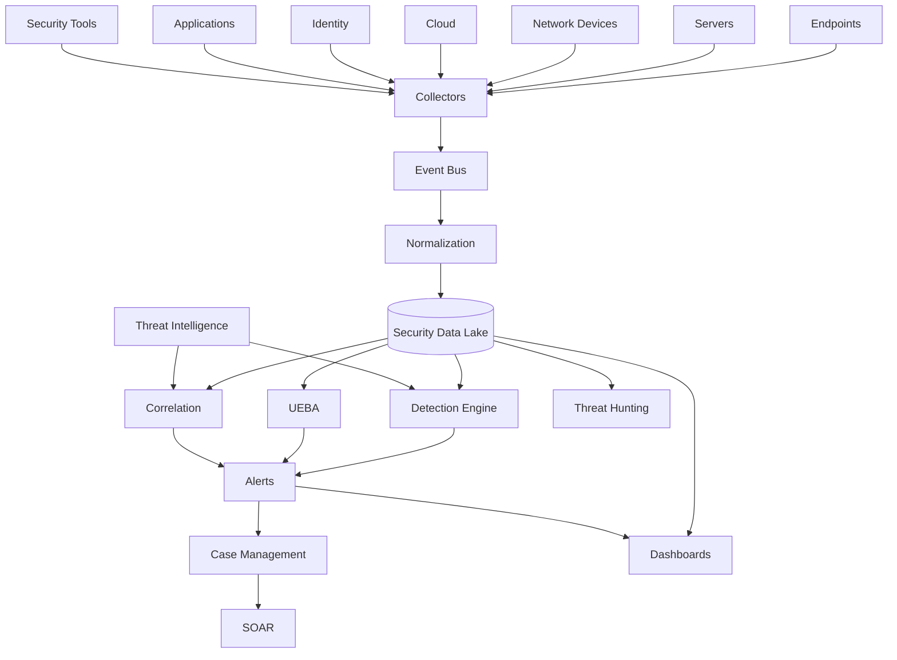


---


## 🔄 Typical SIEM Workflow


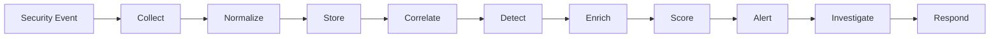


---


## 📥 Log Collection Workflow


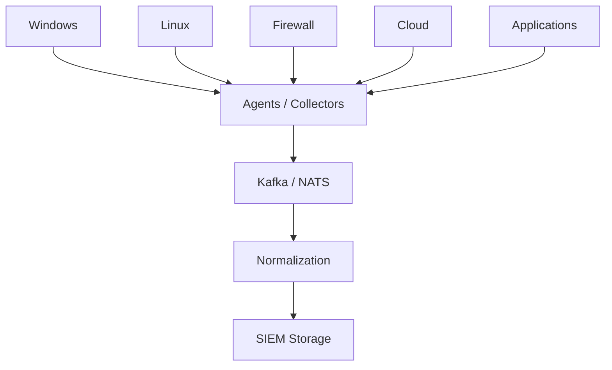


---


## 🎯 Detection Engineering Workflow


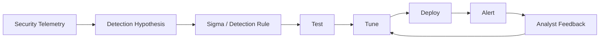


---


## 🏹 Threat Hunting Workflow


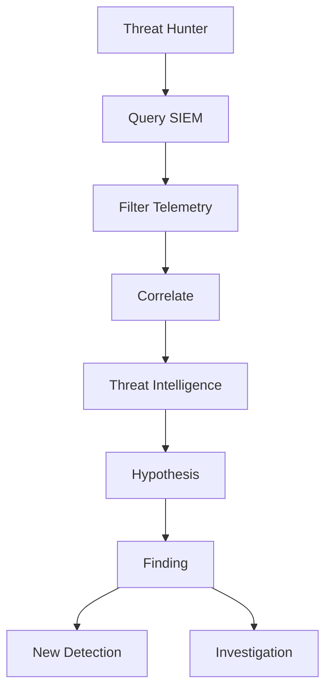


---


## 🔍 Incident Investigation Workflow


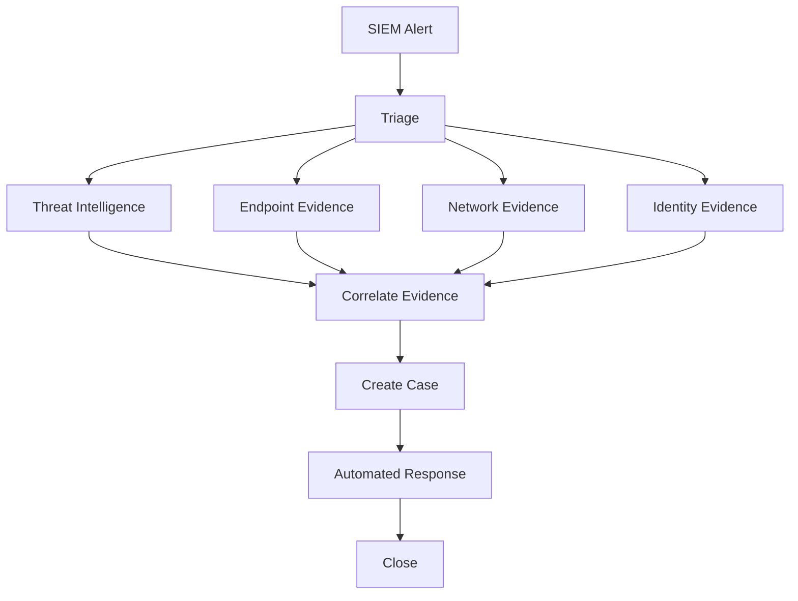


---


## ☁️ Cloud SIEM Workflow


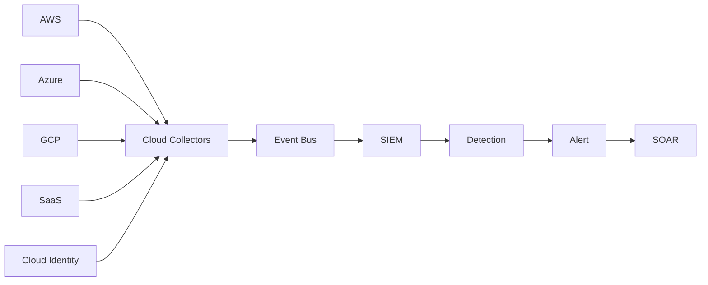


---


# SIEM Data Model


A normalized security event can contain:


```text

timestamp

event_id

event_type

source

destination

user

host

process

command_line

ip

port

protocol

application

cloud_account

resource

severity

action

outcome

threat_indicator

geo

authentication

```


A useful SIEM data model should support:


```text

Entity

   ↓

Event

   ↓

Relationship

   ↓

Detection

   ↓

Alert

   ↓

Incident

```


---


# Entity Model


Modern SIEMs increasingly correlate entities rather than simply individual log messages.


```text

User

  │

  ├── Device

  │

  ├── IP

  │

  ├── Session

  │

  ├── Application

  │

  └── Cloud Resource

```


Example:


```text

alice

  ↓

WORKSTATION-01

  ↓

10.10.10.25

  ↓

powershell.exe

  ↓

External IP

  ↓

Known malicious infrastructure

```


This is much more valuable than examining each event independently.


---


# SIEM Correlation Example


Suppose:


```text

Event 1:

10 failed logins


Event 2:

Successful login


Event 3:

MFA disabled


Event 4:

Privileged group membership changed


Event 5:

Large outbound transfer

```


The SIEM can correlate these events:


```text

10 Failed Logins

      +

Successful Login

      +

MFA Disabled

      +

Privilege Change

      +

Data Exfiltration

      ↓

ACCOUNT COMPROMISE

      ↓

HIGH / CRITICAL

```


---


# SIEM Risk Scoring


A custom SIEM can calculate:


```text

Risk =

Event Severity

+

Entity Risk

+

Threat Intelligence

+

Behavioral Anomaly

+

Privilege

+

Asset Criticality

```


Example:


```text

Critical Server

+

Privileged User

+

Known Malicious IP

+

Unusual Login

+

Large Data Transfer


        ↓


CRITICAL

```


---


# UEBA Architecture


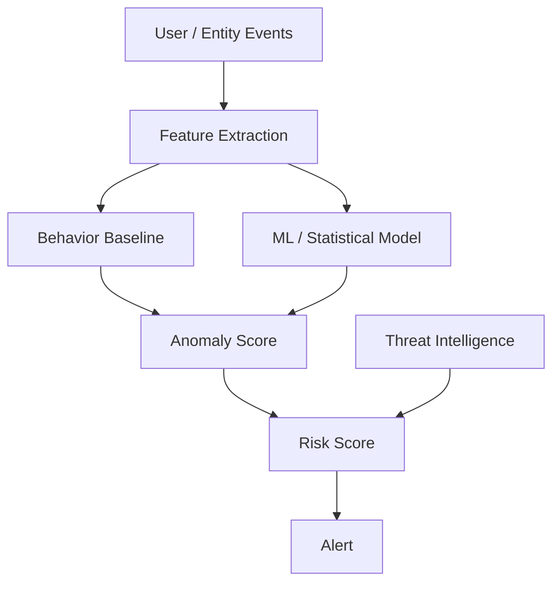


Potential open-source ML components:


* [scikit-learn](https://github.com/scikit-learn/scikit-learn)

* [PyOD](https://github.com/yzhao062/pyod)

* [River](https://github.com/online-ml/river)

* [XGBoost](https://github.com/dmlc/xgboost)

* [LightGBM](https://github.com/microsoft/LightGBM)


---


# Detection Content


A mature SIEM needs a continuously maintained detection library.


Typical categories:


```text

Initial Access

Execution

Persistence

Privilege Escalation

Defense Evasion

Credential Access

Discovery

Lateral Movement

Collection

Command & Control

Exfiltration

Impact

```


MITRE ATT&CK can provide the conceptual framework.


---


# Sigma-Based SIEM Architecture


```text

Sigma Rule

    ↓

Validation

    ↓

Backend Conversion

    ↓

Platform Query

    ↓

Test Dataset

    ↓

Detection Engine

    ↓

Alert

```


This makes Sigma an important interoperability layer across SIEM platforms.


---


# Open-Source SIEM Stack: Minimal


```text

Wazuh

   +

Wazuh Dashboard

   +

Wazuh Indexer

```


Best for:


* small organizations

* labs

* universities

* endpoint-focused monitoring

* compliance

* initial SOC deployments


Wazuh's official documentation describes these three central components plus the Wazuh agent and confirms its free/open-source positioning.


---


# Open-Source SIEM Stack: Search-Centric


```text

Fluent Bit

    ↓

OpenSearch

    ↓

Security Analytics

    ↓

Sigma

    ↓

OpenSearch Dashboards

```


Best for:


* security analytics

* high-volume logs

* custom detection engineering

* teams comfortable with search infrastructure


---


# Open-Source SIEM Stack: Network-Centric


```text

Suricata

   +

Zeek

   +

Arkime

   +

Security Onion

```


Best for:


* network monitoring

* threat hunting

* packet analysis

* NDR-style operations


Security Onion explicitly combines network and host visibility, IDS, packet capture, log management and case management.


---


# Open-Source SIEM Stack: Full SOC


```text

Wazuh

   +

OpenSearch

   +

Security Onion

   +

MISP

   +

OpenCTI

   +

TheHive

   +

Cortex

   +

Velociraptor

   +

Shuffle

```


This creates:


```text

SIEM

+

NDR

+

HIDS/XDR

+

CTI

+

Case Management

+

SOAR

+

DFIR

```


---


## 📋 Capability Matrix


| Capability             |        Splunk ES |         Sentinel |    Google SecOps | Elastic Security |          Exabeam |            Wazuh |       OpenSearch |   Security Onion |            OSSIM |

| ---------------------- | ---------------: | ---------------: | ---------------: | ---------------: | ---------------: | ---------------: | ---------------: | ---------------: | ---------------: |

| Log ingestion          |                ✅ |                ✅ |                ✅ |                ✅ |                ✅ |                ✅ |                ✅ |                ✅ |                ✅ |

| Search                 |                ✅ |                ✅ |                ✅ |                ✅ |                ✅ |                ✅ |                ✅ |                ✅ |                ✅ |

| Correlation            |                ✅ |                ✅ |                ✅ |                ✅ |                ✅ |                ✅ |                ✅ |                ✅ |                ✅ |

| Detection rules        |                ✅ |                ✅ |                ✅ |                ✅ |                ✅ |                ✅ |                ✅ |                ✅ |                ✅ |

| Threat hunting         |                ✅ |                ✅ |                ✅ |                ✅ |                ✅ |                ✅ |                ✅ |                ✅ |                ✅ |

| UEBA                   |                ✅ |                ✅ |                ✅ |                ✅ |                ✅ |          Limited |          Limited |          Limited |          Limited |

| Endpoint telemetry     | Via integrations | Native ecosystem | Via integrations |                ✅ | Via integrations |                ✅ | Via integrations |                ✅ | Via integrations |

| Network telemetry      | Via integrations | Via integrations | Via integrations | Via integrations | Via integrations | Via integrations | Via integrations |                ✅ |                ✅ |

| Threat intelligence    |                ✅ |                ✅ |                ✅ |                ✅ |                ✅ | Via integrations | Via integrations | Via integrations |                ✅ |

| Case management        |                ✅ |  Via integration |                ✅ |                ✅ |                ✅ |          Limited |          Limited |                ✅ |          Limited |

| SOAR integration       | Native ecosystem |           Native |           Native | Native ecosystem |           Native |  Via integration |  Via integration |  Via integration |  Via integration |

| ML / anomaly detection |                ✅ |                ✅ |                ✅ |                ✅ |           Strong |          Limited |                ✅ |          Limited |          Limited |

| Cloud-native           |          Partial |                ✅ |                ✅ |                ✅ |                ✅ |                ✅ |                ✅ |          Partial |          Partial |

| Self-hosted            |                ✅ |                ❌ |                ❌ |                ✅ |          Limited |                ✅ |                ✅ |                ✅ |                ✅ |

| Open source            |                ❌ |                ❌ |                ❌ |  Mixed licensing |                ❌ |                ✅ |                ✅ |    Open platform |   Historical OSS |

| Large-scale deployment |                ✅ |                ✅ |                ✅ |                ✅ |                ✅ |                ✅ |                ✅ |                ✅ |          Limited |


---


## 💡 Recommended Open-Source Stacks


## 1. Best Overall Open-Source SIEM


```text

Wazuh

   +

OpenSearch

   +

Sigma

   +

MISP

   +

TheHive

```


Why:


```text

Wazuh

 ↓

Endpoint + SIEM


OpenSearch

 ↓

Search + Analytics


Sigma

 ↓

Detection Engineering


MISP

 ↓

Threat Intelligence


TheHive

 ↓

Incident Management

```


---


# 2. Best Network-Centric Open-Source SIEM


```text

Security Onion

   +

Suricata

   +

Zeek

   +

Arkime

```


Best for:


* NDR

* network threat hunting

* packet capture

* network forensics


---


# 3. Best Search-Centric Stack


```text

OpenSearch

   +

Security Analytics

   +

Fluent Bit

   +

Sigma

   +

Kafka

```


Best for:


* high-volume logs

* centralized analytics

* custom SIEM development


---


# 4. Best Endpoint-Centric SIEM


```text

Wazuh

   +

Velociraptor

   +

OpenSearch

```


Best for:


* endpoint monitoring

* FIM

* vulnerability detection

* incident response

* threat hunting


---


# 5. Best Threat-Intelligence-Centric SIEM


```text

OpenSearch

   +

Wazuh

   +

MISP

   +

OpenCTI

   +

Cortex

```


---


# 6. Best Full Open-Source SOC


```text

                 Wazuh

                   │

                   ↓

              OpenSearch

                   │

        ┌──────────┼──────────┐

        ↓          ↓          ↓

      MISP      OpenCTI     Sigma

        │          │          │

        └──────────┼──────────┘

                   ↓

                TheHive

                   │

                   ↓

                Shuffle

                   │

        ┌──────────┼──────────┐

        ↓          ↓          ↓

  Velociraptor  Suricata     Zeek

```


---


# 7. Cloud-Native Open-Source Stack


```text

OpenTelemetry

      +

Kafka

      +

OpenSearch

      +

Wazuh

      +

Sigma

      +

MISP

      +

Shuffle

```


---


# 8. Kubernetes Security Stack


```text

Falco

   +

Tetragon

   +

OpenTelemetry

   +

Kafka

   +

OpenSearch

   +

Wazuh

   +

Grafana

```


Useful for:


* container runtime security

* Kubernetes events

* workload behavior

* cloud-native detection


---


# Example SIEM Repository


```text

open-siem/

│

├── collectors/

│   ├── windows/

│   ├── linux/

│   ├── firewall/

│   ├── cloud/

│   └── application/

│

├── pipelines/

│   ├── normalization/

│   ├── enrichment/

│   └── routing/

│

├── detections/

│   ├── sigma/

│   ├── wazuh/

│   ├── suricata/

│   └── custom/

│

├── correlation/

│   ├── authentication/

│   ├── endpoint/

│   ├── network/

│   └── cloud/

│

├── threat-intelligence/

│   ├── misp/

│   └── opencti/

│

├── dashboards/

│

├── hunting/

│

├── playbooks/

│

├── tests/

│

└── README.md

```


---


# SIEM Data Pipeline


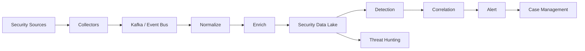


---


## 🤔 What Is Still Difficult to Reproduce in Open Source?


Even with Wazuh, OpenSearch, Security Onion, Elastic, OSSEC and the surrounding ecosystem, several capabilities remain difficult to reproduce as one unified platform.


## 1. Massive-Scale Ingestion


Enterprise SIEMs may ingest:


```text

Millions

to

Billions

of events per day

```


while maintaining:


```text

Low latency

+

High availability

+

Search performance

+

Retention

+

Cost control

```


This requires serious distributed infrastructure.


---


# 2. Mature Detection Content


A SIEM without detection content is essentially a log-search system.


Commercial platforms invest heavily in:


```text

Detection rules

Threat research

ATT&CK mappings

False-positive tuning

New threat coverage

Industry-specific content

```


Open-source users often need to build and maintain these themselves.


---


# 3. UEBA


Advanced behavioral analytics requires:


```text

Historical data

+

Feature engineering

+

Entity resolution

+

Statistical models

+

ML

+

Risk scoring

+

Continuous tuning

```


This is significantly harder than implementing a simple anomaly detector.


---


# 4. Cloud Telemetry


Cloud platforms produce huge numbers of heterogeneous events.


Examples:


```text

AWS CloudTrail

Azure Activity Logs

Microsoft Entra

GCP Audit Logs

Kubernetes

SaaS APIs

Cloud IAM

Cloud Network Flow Logs

```


Normalizing all of them into one coherent security model is challenging.


---


# 5. Detection Engineering at Scale


A production SOC may maintain:


```text

Hundreds

or

Thousands

of detections

```


Each needs:


```text

Testing

Mapping

Tuning

Versioning

Documentation

False-positive analysis

Performance monitoring

```


---


# 6. Search Performance


SIEM workloads are unusual because users simultaneously require:


```text

Recent searches

Historical searches

Aggregations

Joins

Correlations

Full-text search

Time-series analysis

Rare-event detection

```


This creates significant storage and compute requirements.


---


# 7. Data Retention Costs


The SIEM may store:


```text

Raw logs

Normalized logs

Alerts

Events

Network metadata

Packet captures

Endpoint telemetry

Threat intelligence

Audit logs

```


Long-term retention can become the dominant infrastructure cost.


---


# 8. AI-Assisted Investigation


Modern commercial SIEMs increasingly provide:


```text

Natural-language search

Alert summarization

Incident summaries

Detection generation

Threat-hunting assistance

Automated investigation

Entity analysis

```


An open-source implementation can use:


* local LLMs

* Ollama

* vLLM

* Open WebUI

* LangChain

* LlamaIndex


but production-grade security agents require careful:


```text

Authorization

+

Data isolation

+

Tool controls

+

Prompt security

+

Audit

+

Human approval

```


---


## ✨ Why Open Source Is Interesting


The most important open-source opportunity is not simply another log collector.


It is a complete:


> **Open-Source Security Analytics Platform**


combining:


```text

Telemetry

+

Data Lake

+

Detection

+

Correlation

+

Threat Intelligence

+

UEBA

+

Threat Hunting

+

Case Management

+

SOAR

```


A modular architecture can look like:


```text

                    Security Telemetry

                           │

       ┌───────────────────┼───────────────────┐

       ↓                   ↓                   ↓

    Wazuh              Suricata              Zeek

       │                   │                   │

       └───────────────────┼───────────────────┘

                           ↓

                        Kafka

                           ↓

                      OpenSearch

                           ↓

              ┌────────────┼────────────┐

              ↓            ↓            ↓

           Sigma          UEBA         MISP

              │            │            │

              └────────────┼────────────┘

                           ↓

                        Alerts

                           ↓

                        TheHive

                           ↓

                        Shuffle

                           ↓

                       Response

```


---


# Best Open-Source Projects by Use Case


| Use Case                  | Recommended Projects                   |

| ------------------------- | -------------------------------------- |

| Complete open-source SIEM | Wazuh                                  |

| Search-centric SIEM       | OpenSearch                             |

| Network-centric SOC       | Security Onion                         |

| Traditional HIDS          | OSSEC                                  |

| Historical OSS SIEM       | AlienVault OSSIM                       |

| Log management            | Graylog, OpenSearch, Loki              |

| Endpoint telemetry        | Wazuh, Velociraptor, osquery           |

| Network IDS               | Suricata                               |

| Network analysis          | Zeek, Arkime                           |

| Threat intelligence       | MISP, OpenCTI                          |

| Detection rules           | Sigma                                  |

| Malware detection         | YARA                                   |

| Container runtime         | Falco                                  |

| Kubernetes runtime        | Tetragon                               |

| Event streaming           | Kafka, NATS                            |

| Log collection            | Fluent Bit, Fluentd, Vector            |

| Telemetry                 | OpenTelemetry                          |

| Search                    | OpenSearch, Elasticsearch              |

| High-volume analytics     | ClickHouse                             |

| Dashboards                | Grafana, OpenSearch Dashboards, Kibana |

| Incident response         | TheHive, DFIR-IRIS                     |

| SOAR                      | Shuffle, StackStorm                    |

| Endpoint forensics        | Velociraptor, GRR                      |

| ML / UEBA                 | scikit-learn, PyOD, River              |

| Policy                    | OPA, Kyverno                           |


---


# Recommended Open-Source Shortlist


If the objective is to build a serious open-source alternative to the commercial SIEMs listed at the beginning of this README, the first projects to investigate are:


## Tier 1 — Complete SIEM / Security Platforms


1. [Wazuh](https://github.com/wazuh/wazuh)

2. [Security Onion](https://github.com/Security-Onion-Solutions/securityonion)

3. [OpenSearch](https://github.com/opensearch-project/OpenSearch)

4. [Elastic Stack](https://github.com/elastic/elastic-stack)

5. [OSSEC](https://github.com/ossec/ossec-hids)

6. [AlienVault OSSIM](https://github.com/AlienVault-ossim/ossim)


## Tier 2 — Security Data / Analytics


7. [OpenSearch Dashboards](https://github.com/opensearch-project/OpenSearch-Dashboards)

8. [Elasticsearch](https://github.com/elastic/elasticsearch)

9. [Kibana](https://github.com/elastic/kibana)

10. [Graylog](https://github.com/Graylog2/graylog2-server)

11. [ClickHouse](https://github.com/ClickHouse/ClickHouse)

12. [Grafana](https://github.com/grafana/grafana)


## Tier 3 — Detection


13. [Sigma](https://github.com/SigmaHQ/sigma)

14. [YARA](https://github.com/VirusTotal/yara)

15. [Suricata](https://github.com/OISF/suricata)

16. [Zeek](https://github.com/zeek/zeek)

17. [Falco](https://github.com/falcosecurity/falco)

18. [Tetragon](https://github.com/cilium/tetragon)


## Tier 4 — Intelligence / Response


19. [MISP](https://github.com/MISP/MISP)

20. [OpenCTI](https://github.com/OpenCTI-Platform/opencti)

21. [TheHive](https://github.com/TheHive-Project/TheHive)

22. [DFIR-IRIS](https://github.com/dfir-iris/iris-web)

23. [Cortex](https://github.com/TheHive-Project/Cortex)

24. [Shuffle](https://github.com/Shuffle/Shuffle)


---


# Practical Fully Open-Source SIEM/SOC Stack


A serious open-source implementation can use:


```text

                         Security Sources

                               │

            ┌──────────────────┼──────────────────┐

            ↓                  ↓                  ↓

          Wazuh             Suricata             Zeek

            │                  │                  │

            └──────────────────┼──────────────────┘

                               ↓

                            Kafka

                               ↓

                         OpenSearch

                               │

              ┌────────────────┼────────────────┐

              ↓                ↓                ↓

            Sigma             UEBA             MISP

              │                │                │

              └────────────────┼────────────────┘

                               ↓

                           Detection

                               ↓

                            TheHive

                               ↓

                            Shuffle

                               ↓

                   ┌───────────┼───────────┐

                   ↓           ↓           ↓

              Velociraptor  Identity     Firewall

                   │           │           │

                   └───────────┼───────────┘

                               ↓

                            Grafana

```


This provides an open-source architecture spanning:


* SIEM

* endpoint detection

* network detection

* threat intelligence

* detection engineering

* UEBA

* incident management

* SOAR

* endpoint response

* dashboards


---


# SIEM Maturity Model


```text

Level 1

---------

Centralized Logging


        ↓


Level 2

---------

Search + Dashboards


        ↓


Level 3

---------

Detection Rules


        ↓


Level 4

---------

Correlation + Alerting


        ↓


Level 5

---------

Threat Intelligence


        ↓


Level 6

---------

Threat Hunting + UEBA


        ↓


Level 7

---------

SOAR Integration


        ↓


Level 8

---------

AI-Assisted / Autonomous SOC

```


The key transition is from:


```text

Collecting Logs

```


to:


```text

Understanding Security Events

```


---


# SIEM + SOAR Architecture


A modern SOC should generally separate detection from response.


```text

SIEM

 │

 ├── Collect

 ├── Normalize

 ├── Detect

 ├── Correlate

 ├── Hunt

 └── Alert

        │

        ↓

      SOAR

        │

        ├── Enrich

        ├── Investigate

        ├── Approve

        ├── Respond

        └── Audit

```


Open-source combination:


```text

Wazuh / OpenSearch

        +

Shuffle

        +

TheHive

        +

Cortex

        +

MISP

```


---


# SIEM + Threat Intelligence


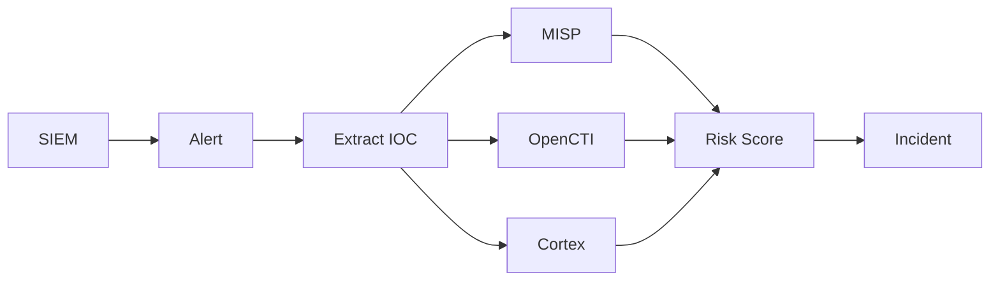


---


# SIEM + Endpoint Response


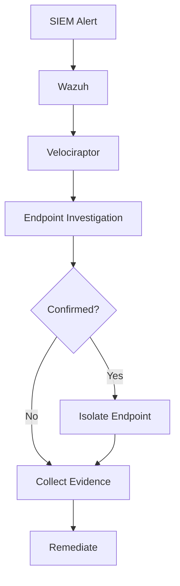


---


# SIEM + Network Detection


```text

Network Traffic

      ↓

Suricata

      +

Zeek

      +

Arkime

      ↓

Kafka / Vector

      ↓

OpenSearch

      ↓

Sigma / Correlation

      ↓

SIEM Alert

```


This is especially valuable for:


* command-and-control

* lateral movement

* DNS tunneling

* data exfiltration

* reconnaissance

* malicious TLS

* suspicious network behavior


---


# Open-Source SIEM Decision Tree


```text

Need a complete free SIEM?

        ↓

     Wazuh


Need network visibility?

        ↓

   Security Onion


Need search/analytics foundation?

        ↓

   OpenSearch


Need Elastic ecosystem?

        ↓

 Elastic Stack


Need lightweight HIDS?

        ↓

     OSSEC


Need threat intelligence?

        ↓

 MISP / OpenCTI


Need case management?

        ↓

 TheHive / DFIR-IRIS


Need SOAR?

        ↓

 Shuffle / StackStorm


Need network IDS?

        ↓

 Suricata / Zeek

```


---


# Conclusion


The SIEM ecosystem has evolved from centralized log collection into a broader security analytics architecture.


The modern SIEM can be represented as:


```text

                         SIEM

                          │

          ┌───────────────┼────────────────┐

          ↓               ↓                ↓

      Collection       Detection        Analytics

          │               │                │

      Wazuh          Sigma/Rules       OpenSearch

      Fluent Bit     Suricata           ClickHouse

      Vector         Zeek               Elasticsearch

          │               │                │

          └───────────────┼────────────────┘

                          ↓

                    Threat Intelligence

                          │

                    MISP / OpenCTI

                          ↓

                       Alerting

                          ↓

                     Investigation

                          ↓

                  TheHive / DFIR-IRIS

                          ↓

                        SOAR

                          ↓

                 Shuffle / StackStorm

                          ↓

                       Response

```


For organizations seeking an open-source alternative, there is no need to reproduce Splunk, Sentinel, Chronicle or QRadar as one monolithic product.


A better strategy is to combine specialized components:


```text

Wazuh

+

OpenSearch

+

Security Onion

+

Sigma

+

Suricata

+

Zeek

+

MISP

+

OpenCTI

+

TheHive

+

Shuffle

```


The most important open-source projects to evaluate first are therefore:


> **Wazuh + OpenSearch + Security Onion + Sigma + Suricata + Zeek + MISP + OpenCTI + TheHive + Shuffle.**


The most interesting opportunity is to build an integrated open-source security analytics platform around these projects that provides:


```text

Collect

 ↓

Normalize

 ↓

Store

 ↓

Detect

 ↓

Correlate

 ↓

Enrich

 ↓

Hunt

 ↓

Investigate

 ↓

Respond

 ↓

Learn

```


This architecture can reproduce a substantial portion of the functional surface traditionally associated with commercial SIEM platforms while retaining control over the underlying data, detection content and infrastructure.


---


## 🤝 How to Contribute


Useful contributions include:


* adding new SIEM platforms

* adding open-source projects

* adding log collectors

* creating Sigma rules

* adding detection content

* documenting ATT&CK mappings

* adding threat-intelligence integrations

* improving parsers

* adding normalization schemas

* documenting cloud integrations

* creating dashboards

* adding threat-hunting queries

* benchmarking ingestion performance

* documenting storage architectures

* adding UEBA examples

* improving SOAR integrations

* creating incident-response workflows

* documenting high-availability deployments


Pull requests are welcome.


---


## 📈 Star History

[](https://star-history.dera.page/#ishandutta2007/Awesome-Security-Information-n-Event-Management&type=date&legend=top-left)

---

## ⚖️ Disclaimer


This README is an ecosystem overview rather than a security certification, product endorsement or guarantee of production readiness.


Open-source availability, licensing, detection coverage, supported integrations and project activity can change.


Before deploying an open-source SIEM, evaluate:


* ingestion capacity

* storage requirements

* retention policy

* detection quality

* false-positive rate

* search performance

* high availability

* disaster recovery

* authentication

* RBAC

* encryption

* audit logging

* threat-intelligence integration

* endpoint coverage

* network visibility

* cloud coverage

* detection engineering capability

* compliance requirements

* operational support


**A SIEM is not simply a log database.**


A production-grade security monitoring environment requires:


```text

Telemetry

+

Detection

+

Correlation

+

Threat Intelligence

+

Investigation

+

Response

+

Continuous Tuning

```


Open-source software can provide the technology for all of these layers, but the effectiveness of the resulting SOC ultimately depends on:


```text

Detection Content

+

Data Quality

+

Architecture

+

Engineering

+

Analyst Expertise

+

Continuous Tuning

```


> **The strongest open-source SIEM strategy is therefore not to find one "free Splunk." It is to assemble an open, modular security platform in which Wazuh/OpenSearch provide the analytics foundation, Sigma/Suricata/Zeek provide detection, MISP/OpenCTI provide intelligence, TheHive/DFIR-IRIS provide investigation and Shuffle/StackStorm provide response automation.**

---

## 🤝 How to Contribute

Contributions are welcome! Please feel free to submit a pull request or open an issue to suggest new open-source SIEM solutions, detection rules, data pipelines, or architecture improvements.

1. Fork the Project
2. Create your Feature Branch (`git checkout -b feature/AmazingFeature`)
3. Commit your Changes (`git commit -m 'Add some AmazingFeature'`)
4. Push to the Branch (`git push origin feature/AmazingFeature`)
5. Open a Pull Request

---

## 📈 Star History

[](https://star-history.dera.page/#ishandutta2007/Awesome-Security-Information-n-Event-Management&type=date&legend=top-left)

---

## ⚖️ Disclaimer

This repository is curated for educational, research, security engineering, and informational purposes only. All product names, logos, brands, and trademarks referenced herein belong to their respective trademark holders.
